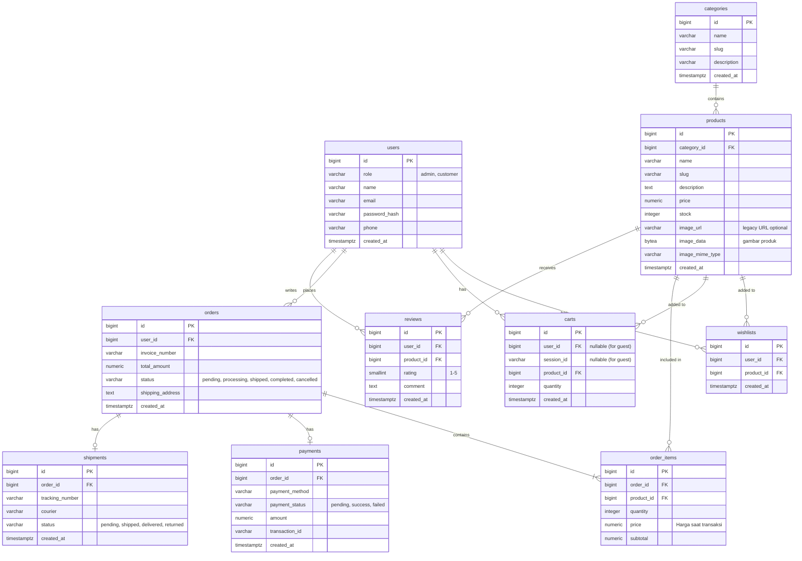

# Database Schema Floratica

File ini berisi dokumentasi skema PostgreSQL, penjelasan relasi, dan justifikasi normalisasi untuk aplikasi E-Commerce Floratica. File SQL utama yang dapat langsung dijalankan tersedia di `backend/migrations/postgresql_schema.sql`.

## 1. Entity Relationship Diagram (ERD)

## 2. Penjelasan Desain dan Normalisasi (3NF)

Desain tabel ini dibuat dengan mematuhi prinsip Third Normal Form (3NF):

1. **Tidak ada duplikasi array/data (1NF)**: Data setiap entitas dipisah secara atomik di dalam row.
2. **Ketergantungan Kunci Penuh (2NF)**: Setiap kolom benar-benar mendeskripsikan primary key-nya. Contoh: `price` produk ada di tabel `products`, bukan nempel di `categories`.
3. **Pemisahan Harga Historis (3NF)**: Perhatikan tabel `order_items` memiliki kolom `price`. Ini adalah **snapshot harga** pada saat pesanan dibuat. Tujuannya adalah jika besok harga produk naik di tabel `products`, harga di invoice riwayat pesanan (order) lama **tidak boleh ikut berubah**. Ini adalah pilar terpenting dalam relasi database E-Commerce.
4. **Relasi Many-To-Many Dibuatkan Tabel Pivot**: Seperti hubungan antara user dan produk yang disukai, dibuatkan tabel `wishlists`. Begitu juga pesanan dengan detail produk yang dipesan via tabel `order_items`.

## 3. Optimasi & Skalabilitas
- Struktur ini sudah diberikan **index PostgreSQL** (bisa dilihat pada schema utama). Kolom seperti `email`, `slug`, dan `category_id` diberikan index untuk mempercepat kecepatan pencarian/query saat data membesar.
- Penerapan `ON DELETE CASCADE` pada tabel keranjang atau wishlist agar database rapi ketika data referensinya dihapus.
- Penerapan `ON DELETE RESTRICT` pada tabel produk jika masuk ke pesanan (`order_items`). Jika admin menghapus produk yang sudah pernah dibeli orang, database akan menolak untuk menjaga integritas riwayat transaksi customer.
